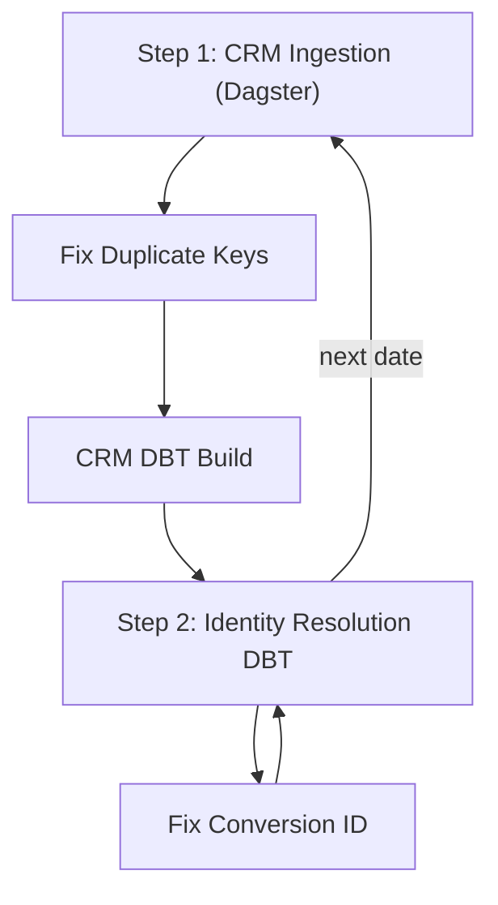

# CRM Backfill Workflow

This diagram illustrates the automated workflow for backfilling CRM data and running identity resolution day-by-day. The process includes error handling and conditional branches for common failure scenarios.



### Quick start
```
# install dependencies
python3 -m venv ../env_pocketflow
source ../env_pocketflow/bin/activate
pip install pocketflow

# copy all data from prod to dev
gsutil -m cp -r "gs://talbots-og-map-us-customer-data/**" gs://talbots-og-map-dev-us-customer-data/

# check crm_log.txt for the latest date

# start the ingestion
python3 nodes.py
```

> **Legend**
> • Solid arrows represent the normal progression.
> • Labeled arrows indicate conditional branches based on step outcomes.
> • "Stop" denotes termination of the flow when an unrecoverable error occurs. 